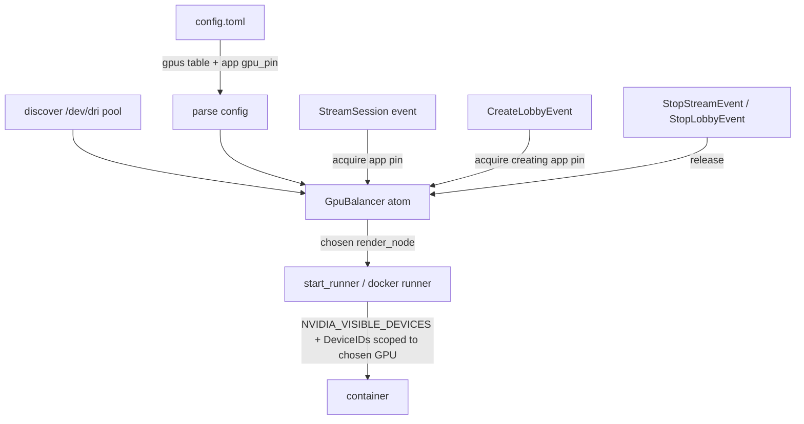

# GPU Load Balancing (per-app)

## Goal
Let Wolf spread app containers across multiple GPUs instead of pinning the whole server to one.
Requirements:
- Per-app GPU assignment (not global).
- Users can **exclude** GPUs from the pool (e.g. an iGPU used for the display).
- Track **how many containers are using each GPU** and prefer a now-free GPU over round-robin.
- Allow an app to be **pinned** to a specific GPU.
- Optional user-supplied **relative performance weight** per GPU (RTX 3090 vs 1660 → send 2+ apps to the 3090 first).

## Confirmed design decisions
- Weighting format: top-level `[gpus]` table mapping render-node path -> integer weight.
  Apps with no pin are balanced by `current_load / weight`.
- Lobbies: assign the GPU **once at lobby creation** (driven by the creating session's app); all
  joining clients share it; release when the lobby stops.

## Current behavior (what we're changing)
- `WOLF_RENDER_NODE` (default `/dev/dri/renderD128`) is the single global GPU, read in
  [`load_or_default`](src/moonlight-server/state/configTOML.cpp:268).
- Each app may override via `render_node` ([`BaseApp::render_node`](src/moonlight-server/state/serialised_config.hpp:122)),
  resolved in [`parse_apps`](src/moonlight-server/state/configTOML.cpp:144) and stored on
  [`events::App::render_node`](src/moonlight-server/events/events.hpp:72).
- That one node flows to the Wayland producer, the GStreamer encode pipeline, and the container
  (`linked_devices` + NVIDIA `--gpus all` / `NVIDIA_VISIBLE_DEVICES=all`) in
  [`start_runner`](src/moonlight-server/sessions/common.cpp:51) and [`RunDocker::run`](src/moonlight-server/runners/docker.cpp:86).
- Nothing counts per-GPU usage; nothing frees a GPU when an app exits.

## Architecture

### New component: `GpuBalancer` (pure, testable)
Location: [`src/moonlight-server/state/gpu_balancer.hpp`](src/moonlight-server/state/gpu_balancer.hpp)
(auto-globbed by `state/*.cpp` / `*/*.hpp`, no CMake edit needed).

Held in `AppState` as `std::shared_ptr<immer::atom<GpuBalancer>>` (matches the immer/atom style used
by `running_sessions`, `lobbies`).

Data:
- `pool`: `map<render_node_path, GpuInfo{ weight (default 1), excluded (bool) }>`
- `usage`: `map<render_node_path, int /* active container count */>`

API (pure functions over an immutable snapshot; caller swaps in the new one via `atom->update`):
- `pick(snapshot, pinned_node) -> optional<render_node>`
  - If `pinned_node` set: return it if present & not excluded (else error/log).
  - Else: among non-excluded GPUs, minimize `usage[node] / weight[node]`; tie-break by lowest usage,
    then stable path order. Return best.
- `acquire(snapshot, node) -> snapshot'` (increments usage)
- `release(snapshot, node) -> snapshot'` (decrements usage, floor 0)

Construction: from the discovered `/dev/dri/renderD*` pool (reusing the iteration pattern in
[`get_nvidia_render_device`](tests/platforms/linux/nvidia.cpp:16)) merged with the `[gpus]` table for
weights/exclusions. The default `WOLF_RENDER_NODE` is always included so single-GPU setups keep working.

### Config model changes
- [`WolfConfig`](src/moonlight-server/state/serialised_config.hpp:140): add `std::map<std::string,int> gpus = {}`
  (render node -> weight). A GPU listed with a special sentinel or a parallel `excluded_gpus` list is
  excluded — simplest: keep `[gpus]` for weights and add `excluded_gpus = [...]` array.
- [`BaseApp`](src/moonlight-server/state/serialised_config.hpp:119): add `std::optional<std::string> gpu_pin`.
- Bump `config_version` to 8 and extend the migration in
  [`load_or_default`](src/moonlight-server/state/configTOML.cpp:218) (new keys are optional/DefaultIfMissing, so old files load fine).
- Update the generated default at `state/default/config.v7.toml` with a commented `[gpus]` example.

### Wiring acquire/release
- **StreamSession**: in the [`StreamSession` handler](src/moonlight-server/sessions/moonlight.cpp:89),
  before starting the producer/runner, call `acquire(app->gpu_pin)`, store the chosen node on the
  session (new field `assigned_render_node`), and use it for both the Wayland producer and the runner
  args. On [`StopStreamEvent`](src/moonlight-server/sessions/moonlight.cpp:60), call `release`.
- **Lobby**: in the [`CreateLobbyEvent` handler](src/moonlight-server/sessions/lobbies.cpp:74), acquire once
  using the creating app's pin; store on the `Lobby`. Release in the
  [`StopLobbyEvent` handler](src/moonlight-server/sessions/lobbies.cpp:266). Joining clients do not re-acquire.
  - **GPU affinity (implemented)**: a lobby must render on the same GPU as the session that is driving it,
    otherwise the session's *already-created* encoder is fed frames from a different GPU and fails. The
    `CreateLobbyRequest` therefore carries an optional `session_id`; the API resolves that session's
    `assigned_render_node` (falling back to `app->render_node`) into a new
    `CreateLobbyEvent.preferred_render_node`. `MoonlightLobbyRuntime::assign_gpu` calls
    `GpuBalancer::pick_preferring(preferred_render_node)`, which uses the preferred node when it is
    available and otherwise logs a warning and falls back to normal load balancing.
  - **Inferring the driving session**: clients don't reliably send `session_id` — wolf-ui creates the
    lobby from inside the session it is running in, but only sends the id on *join*/`runners/start`, not
    on `/lobbies/create`. So when `session_id` is absent, `endpoint_LobbyCreate` falls back to
    `state::get_launcher_session_id`, which returns the **unique** running session whose app has
    `start_virtual_compositor` (i.e. the compositor-running session a lobby is created from). That session
    is then resolved exactly like an explicit `session_id`. If zero or more than one such session exists
    the request is genuinely ambiguous and the lobby load-balances as before.

### Per-GPU container scoping (the correctness crux)
Today [`RunDocker::run`](src/moonlight-server/runners/docker.cpp:86) sets `NVIDIA_VISIBLE_DEVICES=all` and
`DeviceIDs: all`. To actually isolate per GPU, when the assigned node is NVIDIA scope it to that one device:
- `NVIDIA_VISIBLE_DEVICES=<uuid-or-index>` derived from the chosen render node.
- `DeviceRequests[0].DeviceIDs = [<that device>]` instead of `"all"`.
For non-NVIDIA (AMD/Intel) the existing `linked_devices(node)` already passes only that GPU's nodes, so no change.
Deriving the NVIDIA index/uuid from a render node is a small helper in `platforms/hw_linux.cpp`
(`/proc/driver/nvidia/gpus/<bus>/information` already parsed by [`get_nvidia_node`](src/moonlight-server/platforms/hw_linux.cpp:31)).

## Testing
- New Catch2 file `tests/testGpuBalancer.cpp` (pure logic, no GPU needed):
  - weight-aware pick (3090 w=4 vs 1660 w=1 → first two apps land on 3090),
  - exclusion honored, pin override, pin to excluded errors,
  - acquire/release refcount reuse (app quits → next app reuses the freed GPU).
- Add `[gpus]` + `gpu_pin` entries to [`tests/assets/config.test.toml`](tests/assets/config.test.toml) and assert parse.

## Docs
- [`docs/modules/user/pages/configuration.adoc`](docs/modules/user/pages/configuration.adoc): document `[gpus]`,
  `excluded_gpus`, and per-app `gpu_pin`.
